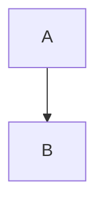
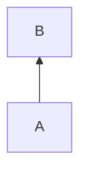
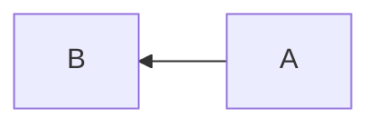
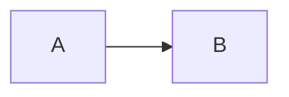

# mermaidで記述できるダイアグラムのチュートリアル
mermaidでフローチャートの記述のしかたを説明します。

## 初めに
フローチャートの作業要素(下記画像の青丸で囲った部分)をノードと呼びます。


### 方向の宣言の方法
・上から下に向ける場合
graph TB　か　graph TD
```
graph TB
    A --> B
```

```
graph TD
    A --> B
```

・下からうえに向ける場合
graph BT
```
graph BT
    A --> B
```

・右から左に向ける場合
graph RL
```
graph RL
    A --> B
```

・左から右に向ける場合
graph LR
```
graph LR
    A --> B
```


## ノードの中に文字を格納する方法
1. ノードをかきます。
    ```
    graph TB
    A
    ```
    ```Mermaid
    graph TB
    A
    ```
2. ノードに文字を格納します。
    ```
    graph TB
    A["こんにちは"]
    ```
    ```Mermaid
    graph TB
    A["こんにちは"]
    ```
## ノードの形を変える方法

### 1.四角にしたい場合
四角にしたい場合は["x"]を使用します。
```
graph TB
A["こんにちは"]
```
```Mermaid
graph TB
A["こんにちは"]
```
## 2.角を丸くしたい場合
四角が["x"]だったのに対して、角を丸くしたい場合は("x")を使用します。
```
graph TB
A("こんにちは")
```
```Mermaid
graph TB
A("こんにちは")
```
## 3.円形にしたい場合
円形にしたい場合は(("x"))のようにします。
```
graph TB
A(("こんにちは"))
```
```Mermaid
graph TB
A(("こんにちは"))
```